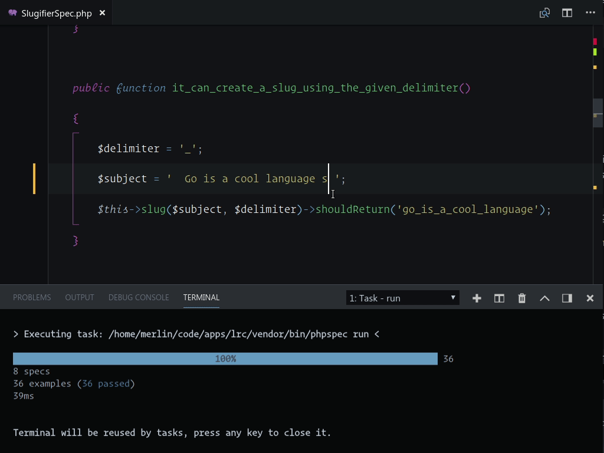

# phpspec-run

A small extension around the ```phpspec run``` command. This extension helps you speedup your phpspec testing workflow.

> This extension registers a task to run each command. This enables the use of the color built-in terminal



## Commands

### Run spec nearest to the cursor
 - Place cursor inside or on a specification
 - Open the command pallet (Windows, Linux `Ctrl+Shift+P` MacOS `⇧⌘P`)
 - Select `phpspec-run: here`
> Assigned keybinding `ctrl+alt+p`

Equal to running ```$ bin/phpspec run spec/ClassNameSpec.php:56{specification line number}```

### Run a spec (file)
 - Open the command pallet (Windows, Linux `Ctrl+Shift+P` MacOS `⇧⌘P`)
 - Select `phpspec-run: spec`
> Assigned keybinding `ctrl+alt+o`

Equal to running ```$ bin/phpspec run spec/ClassNameSpec.php```

### Run all specs found in the current spec directory and its subdirectories
 - Open the command pallet (Windows, Linux `Ctrl+Shift+P` MacOS `⇧⌘P`)
 - Select `phpspec-run: directory`
> Assigned keybinding `ctrl+alt+k`

Equal to running ```$ bin/phpspec run spec/{folder}```

### Run all specs
 - Open the command pallet (Windows, Linux `Ctrl+Shift+P` MacOS `⇧⌘P`)
 - Select `phpspec-run: suite`
> Assigned keybinding `ctrl+alt+l`

Equal to running ```$ bin/phpspec run```

### Run previous command
 - Open the command pallet (Windows, Linux `Ctrl+Shift+P` MacOS `⇧⌘P`)
 - Select `phpspec-run: previous`
> Assigned keybinding `ctrl+alt+0`

## Extension Settings

This extension contributes the following settings:
```
{
    "phpspec-run.commandSuffix": null, // String to add to the end of the phpspec command,  it's a great place to add flags like '--stop-on-failure'
    "phpspec-run.phpspecBinary": null, // Path to the phpspec binary. Ex: 'phpspec', '/usr/local/bin/phpspec'
    "phpspec-run.ssh.enable": null, // Enable tests to run over SSH`
    "phpspec-run.ssh.user": null, // The user to connect as when running test via SSH`
    "phpspec-run.ssh.host": null, // The hostname to use when running tests via SSH
    "phpspec-run.ssh.paths": 22, // The SSH path map. Keys are local (host) paths and values are remote (guest) paths.
    "phpspec-run.ssh.binary": null, // The path (and flags) to an SSH-compatible binary. If null it will use SSH on *nix and Putty on Windows.
    "phpspec-run.ssh.options": null, // Extra command line options to pass to the ssh binary
}
```

### Keybindings

```
{
    "key": "ctrl+alt+p",
    "command": "phpspec-run.here"
},
{
    "key": "ctrl+alt+o",
    "command": "phpspec-run.spec"
},
{
    "key": "ctrl+alt+l",
    "command": "phpspec-run.suite"
},
{
    "key": "ctrl+alt+k",
    "command": "phpspec-run.directory"
},
{
    "key": "ctrl+alt+0",
    "command": "phpspec-run.previous"
}
```

## Coming Soon

- Problem matchers: Display test failures in the "Problems" panel

**Inspired by [Better PHPUnit](https://marketplace.visualstudio.com/items?itemName=calebporzio.better-phpunit)!**
